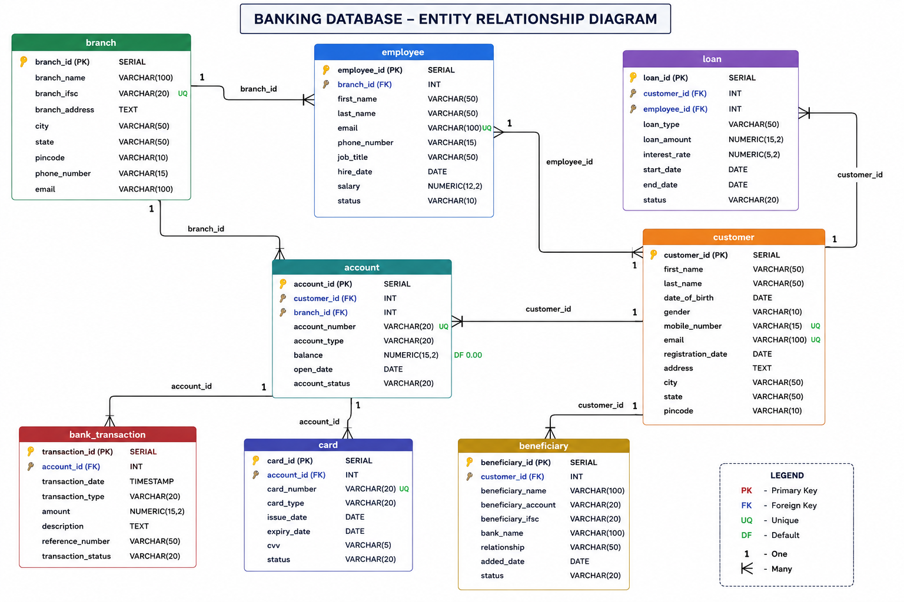

# 🏦 Bank Management System using PostgreSQL

## 📌 Overview

This project is a relational database system for a banking environment designed using PostgreSQL. It demonstrates database design, normalization, constraints, SQL queries, and PostgreSQL concepts used in real-world banking applications.

The project was built as part of my PostgreSQL Administration and Database Support learning journey.

---

## ✨ Features

- Customer Management
- Branch Management
- Employee Management
- Account Management
- Loan Management
- Card Management
- Beneficiary Management
- Transaction Management
- Primary & Foreign Keys
- Constraints
- Relational Database Design

---

## 🛠 Technologies Used

- PostgreSQL
- SQL
- pgAdmin 4
- Linux
- AWS EC2
- Git & GitHub

---

## 🗂 Database Schema

The database contains the following tables:

- Branch
- Customer
- Employee
- Account
- Loan
- Card
- Beneficiary
- Bank Transaction

---

## 📊 Entity Relationship Diagram



---

## 📂 Repository Structure

```
Bank-Management-System-PostgreSQL
│
├── Database
│   ├── create_tables.sql
│   ├── insert_branch.sql
│   ├── insert_customer.sql
│   ├── insert_employee.sql
│   ├── insert_account.sql
│   ├── insert_loan.sql
│   ├── insert_card.sql
│   ├── insert_beneficiary.sql
│   └── insert_bank_transaction.sql
│
├── ER-Diagram
│
└── README.md
```

---

## 💡 SQL Concepts Covered

- DDL
- DML
- Primary Keys
- Foreign Keys
- Constraints
- Data Types
- Relational Database Design

---

## 🚀 Upcoming Enhancements

- SQL Joins
- Aggregate Functions
- GROUP BY & HAVING
- Window Functions
- Common Table Expressions (CTEs)
- Views
- Subqueries
- Backup & Restore
- PostgreSQL Administration
- Linux Administration
- AWS EC2 Deployment

---

## 👨‍💻 Author

**Atharva Phatak**

B.Sc. Computer Science

Aspiring PostgreSQL Database Administrator | Linux | AWS | SQL
